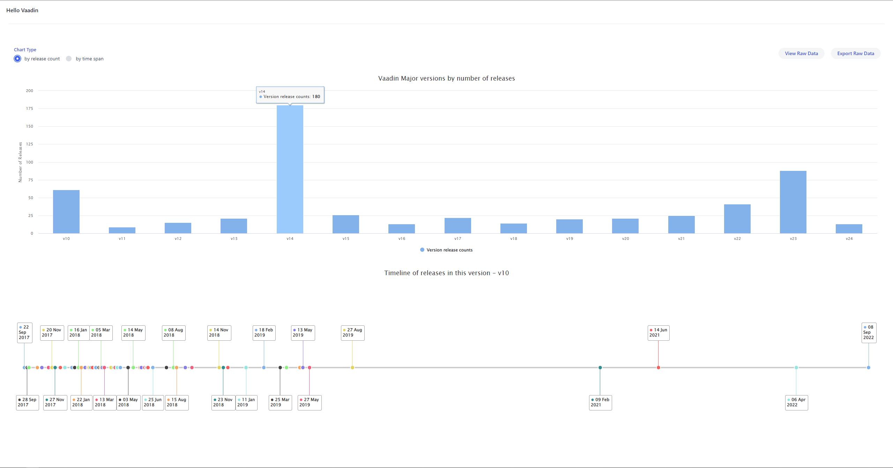

# Hackathon-24

This application reads the tags of all the releases in `vaadin/platform` github repository and displays the data with various charts.
There is also a provision to view the data in a spreadsheet within a dialog as well as to export the entire raw data.

##### Show all vaadin releases with the number of release in each major version.

##### Show all vaadin releases by time span indication how long a major version was supported/patched.

##### Click the top chart to see the timelines of the selected version line.

##### Click the specific version in the timeline chart below to see the release notes (access via Github API)

##### View the raw data in embedded spreadsheet or export the file.

## Pre-requisites
- The vaadin/platform repository needs to be locally cloned and the path mentioned in `application.properties` file.
- A personal access token needs to be created in github and the same needs to be saved in `password.properties` file with the key as `github.personal.token`

## Running the application

The project is a standard Maven project. To run it from the command line,
type `mvnw` (Windows), or `./mvnw` (Mac & Linux), then open
http://localhost:8080 in your browser.

You can also import the project to your IDE of choice as you would with any
Maven project. Read more on [how to import Vaadin projects to different 
IDEs](https://vaadin.com/docs/latest/guide/step-by-step/importing) (Eclipse, IntelliJ IDEA, NetBeans, and VS Code).

