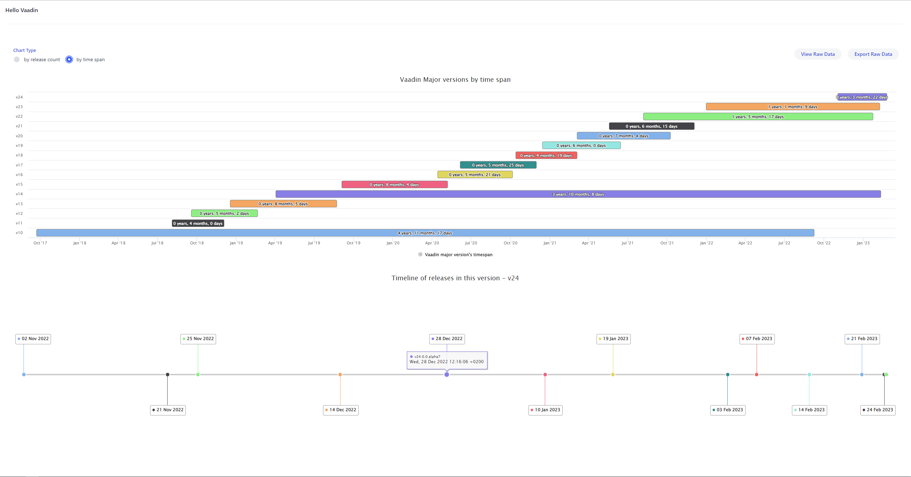

# Releases Graph

This application reads the tags of all the releases in `vaadin/platform` github repository and displays the data with various charts.
There is also a provision to view the data in a spreadsheet within a dialog as well as to export the entire raw data.

##### Show all vaadin releases with the number of release in each major version.

##### Show all vaadin releases by time span indication how long a major version was supported/patched.

##### Click the top chart to see the timelines of the selected version line.

##### Click the specific version in the timeline chart below to see the release notes (access via Github API)

##### View the raw data in embedded spreadsheet or export the file.

## Requisites

You need these environment variables in order to run the app:

  - `GITHUB_TOKEN` for accessing GitHub GraphQL usage
  - `CACHEFOLDER` (optional) for placing the cache file, otherwise it uses system tmp

## Running the application

The project is a standard Maven project. To run it from the command line,
type `mvnw` (Windows), or `./mvnw` (Mac & Linux), then open
http://localhost:8080 in your browser.

